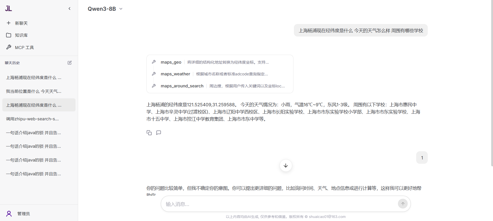

# JavaLab Agent

<p align="center">  </p>


基于 Spring AI 的智能 RAG（检索增强生成）对话系统，集成本地大模型，支持知识库管理和智能问答。



## 🛠️ 技术栈

| 技术 | 版本 | 说明 |
| :---: | :---: | :---: |
| Spring Boot | 3.4.2 | 核心框架 |
| JDK | 17 | 运行环境 |
| Spring AI | 1.0.0-M5 | AI 框架 |
| PostgreSQL | 16.6 | 数据库 |
| pgvector | 0.7.2 | 向量存储 |
| Vue.js | 3.x | 前端框架 |

## 📋 项目简介

主要功能包括：
- 🤖 智能上下文对话：基于 RAG 技术实现精准问答，支持 SSE 流式响应，带来流畅交互体验
- 📚 全流程知识库管理：支持文档上传、自动切片、向量化存储与智能检索，高效管理知识资产
- 👤 完善的用户体系：基于 JWT 实现身份认证，配套精细的用户权限管理，保障系统访问安全 
> 集成多种大模型，摘要记忆


## 🚀 快速开始

### 1. 环境配置

在项目根目录创建 .env 文件，填写以下配置项（按需选择对应配置）：

```env
# =================【必需配置】=================
# Ollama 服务地址
OLlama_BASE_URL=http://xxx:11434
# 镜像tag 镜像地址：mailacs/javalabagent-backend
IMAGE_TAG=2026012201

# =================【存储配置（二选一）】=================
# 存储类型：minio（默认）或 alioss（阿里云）
# STORAGE_TYPE=minio

# ---------- 方式一：MinIO 配置（推荐，无需云服务） ----------
# MinIO 会随 docker compose 自动启动，以下为默认值，可不修改
# MINIO_ROOT_USER=minioadmin
# MINIO_ROOT_PASSWORD=minioadmin123
# MINIO_BUCKET=javalab

# ---------- 方式二：阿里云 OSS 配置（可选配置） ----------
# OSS_ACCESS_KEY_ID=your_access_key_id
# OSS_ACCESS_KEY_SECRET=your_access_key_secret
# OSS_BUCKET_NAME=your_bucket_name
# OSS_ENDPOINT=your_oss_endpoint

# =================【可选配置】=================
# PostgreSQL 数据库配置 (有默认值，可不设置)
# POSTGRES_USER=postgres
# POSTGRES_PASSWORD=admin
# POSTGRES_DB=postgres
```


### 2. Docker 一键启动

确保已安装 Docker 和 Docker Compose，然后在根目录执行：

**生产环境启动**
```bash
docker compose -f docker-compose.prod.yml up -d
```
开发 / 测试环境启动
```bash
docker compose up -d --build
```

访问地址：

- **前端地址**: [http://localhost](http://localhost)
- **后端接口**: [http://localhost:8989](http://localhost:8989)
- **MinIO 控制台**: [http://localhost:9001](http://localhost:9001)（用户名：minioadmin，密码：minioadmin123）
- **数据库**: http://localhost:5432 (PostgreSQL + pgvector)

辅助命令

1、清理所有容器与数据卷（谨慎使用，会删除所有数据）
```bash
docker compose down -v
```

镜像推送（用于部署分发）
```bash
# 构建并推送后端镜像
docker build -t mailacs/javalabagent-backend:2026022601 -f javalab-agent-back/Dockerfile javalab-agent-back
docker push mailacs/javalabagent-backend:2026022601

# 构建并推送前端镜像
docker build -t mailacs/javalabagent-frontend:2026022601 -f javalab-agent-front/Dockerfile javalab-agent-front
docker push mailacs/javalabagent-frontend:2026022601
```

---

未来优化方向：
- 多模态支持：支持图片、音频、视频等
- MCP 工具集成
- Agent ReAct 框架集成
- skills 模块集成
- 对话管理优化


